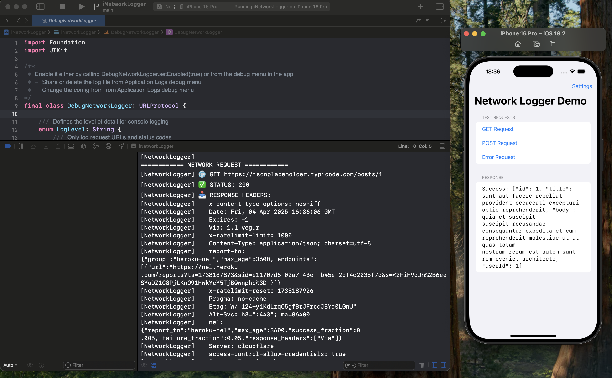
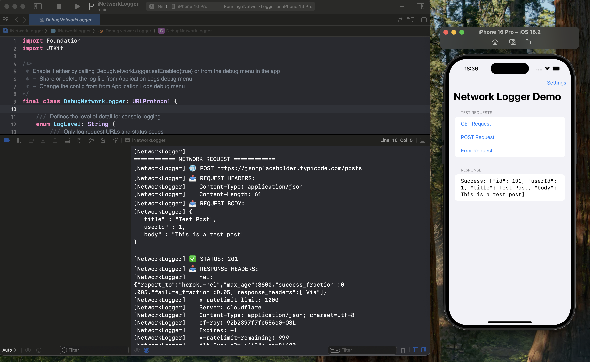
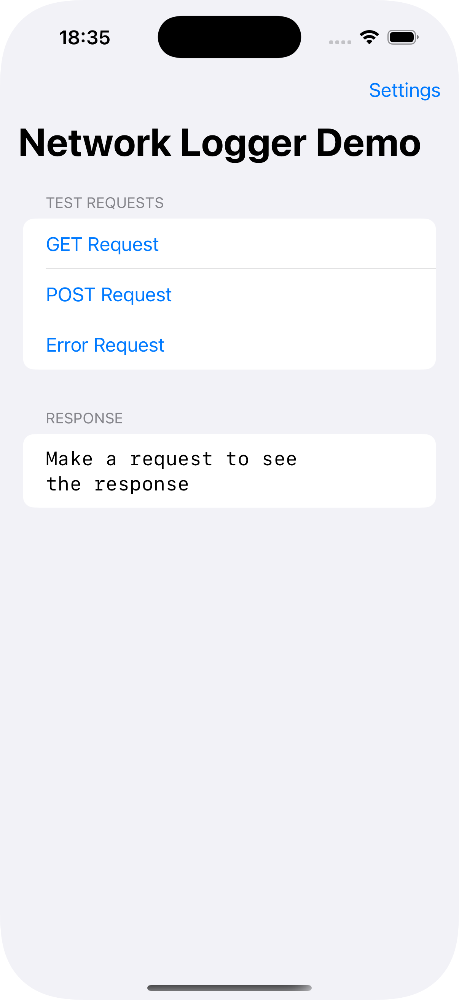
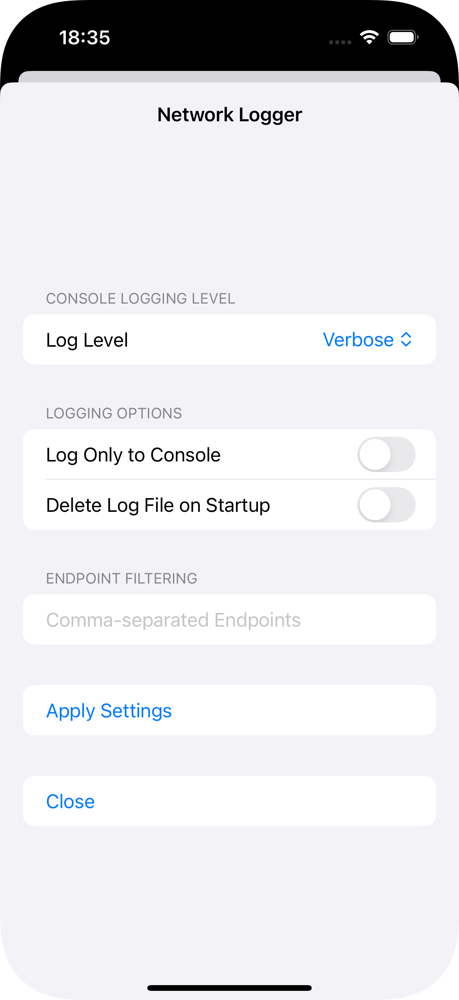

# iNetworkLogger

A lightweight, easy-to-use network logging class for iOS and macOS applications. Monitor and debug your network requests with ease.

## Features

- 🔍 Intercept and log all network requests and responses
- 📝 Multiple logging levels (minimal, verbose, file-only)
- 💾 Save logs to file for later analysis
- ⚙️ SwiftUI settings interface for easy configuration
- 🎯 Filter specific endpoints
- 📱 Real-time console logging
- 🎨 Request/response formatting

## Preview

<p>
  &nbsp;&nbsp;&nbsp;&nbsp;
  
</p>


<p float="left">
  &nbsp;&nbsp;&nbsp;&nbsp;
  
</p>


### Log Levels

- `minimal`: Only logs request URLs and status codes
- `verbose`: Logs full request and response details
- `onlyToLogFile`: Only writes to log file, no console output

### Accessing Logs

Real-time console logging is available in the Xcode console.

The log file is stored in the app's Library directory:
```swift
/Library/logs/network.log
```

When running in the simulator, you can view real-time logs using:
```bash
tail -f "/path/to/app/Library/logs/network.log"
```

### Filtering Endpoints

You can filter specific endpoints by providing a comma-separated list in the settings:
```
api.example.com,api2.example.com
```

## License

This project is licensed under the MIT License - see the [LICENSE](LICENSE) file for details.

## Contributing

Contributions are welcome! Please feel free to submit a Pull Request. 
